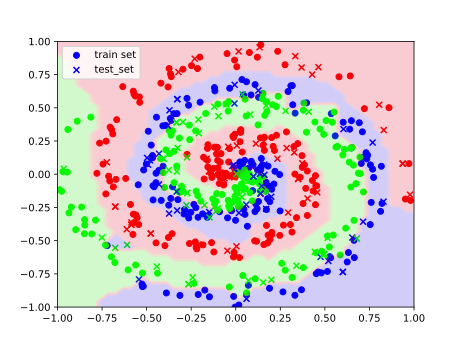
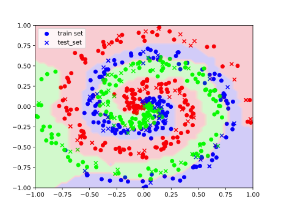
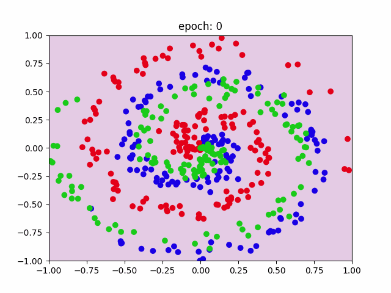
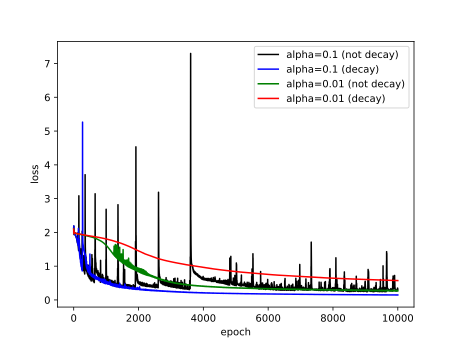
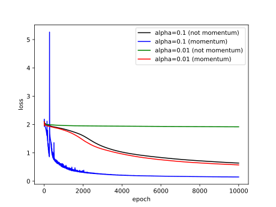
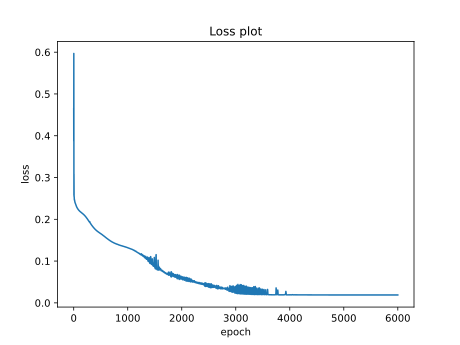
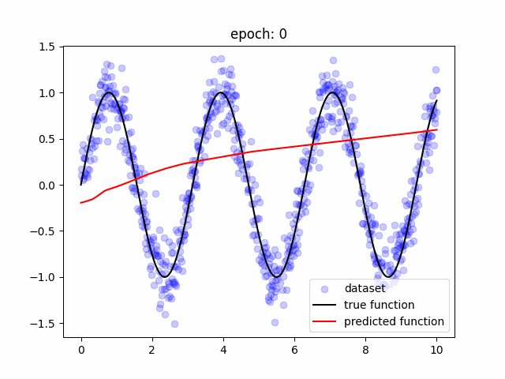

# Neural Network from scratch using Python

This project has an objective to create a simple code of Machine Learning algorithm from scratch in OOP style. I choose Neural Network algorithm for this project.  

## Table of Contents
1. [What is Neural Network?](#what-is-nn)
2. [Components of Learning](#component-of-learning)
3. [Pseudocode](#pseudocode)
4. [Examples](#examples)
5. [References](#references)
6. [Conclusions](#conclusions)

## What is Neural Network? <a name="what-is-nn"/>

Neural Network is one of the popular algorithms in Machine Learning which are inspired by organic brains. This model consists of interconnected nodes, known as neurons, organized into layers. The network's structure is typically divided into three main types of layers: input layer, hidden layers, and output layer. Details of this model will be explained later.

---
## Components of Learning <a name="component-of-learning"/>

### Hypothesis
Set of all linear lines.

### Parameters
- Weights or coefficients
- Intercepts

### Learning Algorithm
**Objective: minimizing** the loss function based on the case (classification or regression). This objective can be achieved by using gradient descent with additional algorithms to increase its efficiency. 

Hyperparameter for this algorithm:
- Network structure
  - Number of hidden layers
  - Number of neurons in each layer
  - Activation function
- Learning & optimization
  - Learning rate
  - Batch size
  - Epochs
  - Decay
  - Momentum
- Regularization
  - Lambda

### Prediction
**Output:** most probable class for classification and some value for regression.

---
## Pseudocode <a name="pseudocode"/>

### Solve the model parameters (fitting)
- Input
  - Set of training data with input X and output y
  - Network structure : list of hidden_layer_sizes, activation function
  - Optimization : learning_rate $\alpha$, batch_size, max_iter, decay, momentum $\beta$
  - Regularization : lambda $\lambda$
- Output
  - coef_ : the weight $W$
  - intercept_ : the intercept $b$
- Stopping criterion
  - Maximum iteration (epoch)
- Process
> Initialize parameters: random value by Xavier's method.
>
> Initialize learning rate $\alpha = \alpha_0$ and the velocity of coefficients and intercepts as 0.
> 
> **while** (iter < max_iter):
>> Initialize total loss = 0
>>
>> Update learning rate $\alpha := \alpha / (1 + decay \cdot iter)$
>> 
>> **for** batch_slice in batches **do**
>>> **Forward pass**. 
>>>> $a^{[0]} = X$
>>>> 
>>>> **for** k = 1 to last_layer $L$ - 1 **do**
>>>>> Compute activation value $a^{[k]} = \sigma(Z^{[k]}) = \sigma(W^{[k]^T} a^{[k-1]} + b^{[k]})$
>>>>> 
>>>> Compute batch_loss = $\mathcal{L}(a^{[L-1]})$
>>>
>>> **Backward pass**. 
>>>> Compute gradient for last layer $\partial \mathcal{L}/ \partial Z^{[L-1]} = a^{[L-1]} - y \rightarrow \partial \mathcal{L}/ \partial W^{[L-1]}$  and $\partial \mathcal{L}/ \partial b^{[L-1]}$
>>>> 
>>>> **for** i = $L$ - 1 to 1 **do**
>>>>
>>>>> Compute gradient w.r.t. $Z$: $\partial \mathcal{L}/ \partial Z^{[i-1]} = W^{[i]^T} \partial \mathcal{L}/ \partial Z^{[i]}$
>>>>>
>>>>> Compute gradient w.r.t. $W$: $\partial \mathcal{L}/ \partial W^{[i-1]} = \frac{1}{n_{samples}} \left( a^{[i-1]^T} \partial \mathcal{L}/ \partial Z^{[i-1]} + \lambda W^{[i-1]} \right)$
>>>>>
>>>>> Compute gradient w.r.t. $b$: $\partial \mathcal{L}/ \partial b^{[i-1]} = \frac{1}{n_{samples}} \sum \partial \mathcal{L}/ \partial Z^{[i-1]}$
>>>>> 
>>> Compute total loss += batch_loss
>>>
>>> **Update parameters**.
>>>> Change of coefficients: $dW^{[i]} := \beta \cdot v_W^{[i]} - \alpha \cdot \partial \mathcal{L}/ \partial W^{[i]}$
>>>>
>>>> Change of intercepts: $db^{[i]} := \beta \cdot v_b^{[i]} - \alpha \cdot \partial \mathcal{L}/ \partial b^{[i]}$
>>>>
>>>> Save change of parameters as new velocity: $v_W^{[i]} := dW^{[i]}$ and $v_b^{[i]} := db^{[i]}$
>>>>
>>>> Update value of parameters: $W^{[i]} := W^{[i]} + dW^{[i]}$ and $b^{[i]} := b^{[i]} + db^{[i]}$

### Predict

- Input
  - X : The input of test data set
- Output
  - y_pred : The prediction
- Process
> **Forward pass**. 
>> $a^{[0]} = X$
>> 
>>> **for** k = 1 to last_layer $L$ - 1 **do**
>>>> Compute activation value $a^{[k]} = \sigma(Z^{[k]}) = \sigma(W^{[k]^T} a^{[k-1]} + b^{[k]})$
>>>> 
>>> $y_{pred}$ = $a^{[L-1]}$
>>> 

---
## Examples <a name="examples"/>

### Case 1: Classification case for spiral data

In this case, I want to train the Neural Networks to learn spiral data for several classes. The sample data are generated by function in polar coordinates in which the distance from the origin is linear w.r.t. angle from positive x1 direction. Noise is given to the data by random value with maximum value $\sigma_{noise} < 1$.

Control hyperparameters for this case are:
- Number of classes = 33
- Number of samples per class = 200
- Test size = 25%
- Hidden layer sizes = (128, 64)
- Regularization lambda = 1e-4
 
### A. Effect of learning rate
To observe the effect of learning rate, I apply momentum optimization and decaying learning rate for two values of initial learning rate. The first one, initial learning rate is 1e-1 and the second variation is using initial learning rate equal to 1e-2. Some comparisons are shown in the next table.

|  | $\alpha = 10^{-1}$ | $\alpha = 10^{-2}$ |
| :--- | :---: | :---: |
| max_iter | 3000 | 10000 |
| train accuracy | 95.1% | 89.6% |
| test accuracy | 81.3% | 82.7% |

  
   
  <em>Results of classification by Neural Networks model. Left figure for learning rate = 1e-1 and the right one for learning rate = 1e-2.</em>

Based on the results, higher train accuracy can be achieved by smaller number of max_iter for large learning rate since the learning process is faster. The problem arises when we look at test accuracy, large learning rate gives higher train accuracy but lower test accuracy with difference of about 14%, and for lower learning rate gives higher test accuracy with small difference against train accuracy. These results show us a sign of overfitting over data with higher learning rate. After all, the 1% difference in test accuracy for those two learning rates is negligible for practical cases and higher learning rate is more efficient because lower max_iter is used.

  
   
  <em>Animation of contour plot for the predicted region of every class. Left animation for learning rate = 1e-1 and the right one for learning rate = 1e-2.</em>

### B. Effect of decaying learning rate
To observe the effect of decaying learning rate, I apply momentum optimization, max_iter = 1000, and two values of initial learning rate; 1e-1 and 1e-2. The results are shown in the table and the loss plot.

|  | $\alpha = 10^{-1}$ (not decay) | $\alpha = 10^{-1}$ (decay) | $\alpha = 10^{-2}$ (not decay) |  $\alpha = 10^{-2}$ (decay) |
| :--- | :---: | :---: | :---: | :---: |
| train accuracy | 93.6% | 96.9% | 95.1% | 89.6% |
| test accuracy | 83.3% | 82.0% | 81.3% | 82.7% |

   
  <em>Loss plot for some combinations of learning rate and whether use decaying learning rate or not.</em>

Based on the plot, the decaying learning rate over iteration gives smoother loss plot. High fluctuation of loss for high learning rate (1e-1) is more often occurs even in higher epochs and after using the decaying algorithm, the high fluctuation occurs only in small epochs and more stable in higher epochs. On a lower learning rate (1e-2), the decaying algorithm is slower than without the decaying algorithm but still gives high test accuracy that indicates decaying learning rate also reduces overfitting on train process.

### C. Effect of momentum optimization
To observe the effect of momentum optimization, I apply decaying learning rate, max_iter = 1000, and two values of initial learning rate; 1e-1 and 1e-2. The results are shown in the table and the loss plot.

|  | $\alpha = 10^{-1}$ (not momentum) | $\alpha = 10^{-1}$ (momentum) | $\alpha = 10^{-2}$ (not momentum) |  $\alpha = 10^{-2}$ (momentum) |
| :--- | :---: | :---: | :---: | :---: |
| train accuracy | 88.2% | 96.9% | 36.7% | 89.6% |
| test accuracy | 80.7% | 82.0% | 35.3% | 82.7% |

   
  <em>Loss plot for some combinations of learning rate and whether use momentum optimization or not.</em>

Based on the plot, momentum optimization has a bigger impact on accelerating the learning process and gives better test accuracy. For lower learning rate without momentum, the plot shows stagnant loss that becomes a sign of local optimal solution, and with momentum algorithm, the solution can reach a lower loss value.

---

### Case 2: Regression case for sine data

In this case, I want to train the Neural Networks to learn simple sine data. Noise is given to the data by random value with maximum value $\sigma_{noise} < 1$. 

Hyperparameters for this case are:
- Number of samples = 1000
- Test size = 25%
- Hidden layer sizes = (128, 64)
- Initial learning rate = 1e-2
- Max epochs = 6000
- Using decaying learning rate and momentum optimization.

The results of this learning process are shown in loss plot and animation of predicted function. 

   
  <em>Loss plot for regression case of sine data.</em>

   
  <em>Animation of predicted function.</em>

Loss value for train data is 0.019 and for test data is 0.021. The difference is not so large and the predicted function not overfitting the train data, instead give a similar plot for true sine function. 

---

## Conclusions <a name="conclusions"/>

From this project, simple codes of Neural Network from scratch can be used to predict target values for classification and regression cases. Main idea for Neural Networks is the back-propagation step which is used to compute the parameter of the model. Main problem for this algorithm is easy to overfitting the train data. Thus, we need some hyperparameters and optimization algorithms to increase its efficiency. In this project, some attempts to overcome this problem are using regularization, decaying learning rate, and add momentum optimization. From some examples before, we can learn that hyperparameter tuning is very important to avoid overfitting and increase its efficiency.

For future works, more optimization algorithms can be added like Adam optimizer or RMSprop. The codes can be developed furthermore for complex cases like Physics-Informed Neural Network with automatic differentiation algorithm to compute gradients of loss from differential equations.

---

## References <a name="references"/>

- Glorot, X., & Bengio, Y. (2010). Understanding the difficulty of training deep feedforward neural networks.
- Kinsley, H., & Kukiela, D. (2020). Neural Networks from Scratch in Python.
- Ng, A. (2023). CS229 Lecture Notes. https://cs229.stanford.edu/lectures-spring2022/main_notes.pdf
- Scikit Learn documentation on Multi-layer Perceptron. https://scikit-learn.org/stable/modules/generated/sklearn.neural_network.MLPClassifier.html
